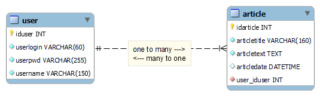

# exemple5MVC

## Configuration

Importation du fichier `data/exemple5mvc-structure-datas-02.sql` dans votre base de données MySQL.

## Fichiers de configuration

Dupliquez le fichier `config-dev.php` et renommez-le-en `config-prod.php`. Il se trouve actuellement dans le `.gitignore`, pour des raisons de sécurité.

## Identifiants

### Pour se connecter à l'administration

Il faudra se connecter avec un des utilisateurs présents dans la base de données.

### Utilisateurs dans la DB

- `admin` | `admin123` | `Pitz Michaël`
- `modo` | `123modo` | `Sandron Pierre`
- `user` | `use123r` | `Sall Magib`

### Notre base de donnée `exemple5mvc` en v1

### Notre base de donnée `exemple5mvc` en v2

